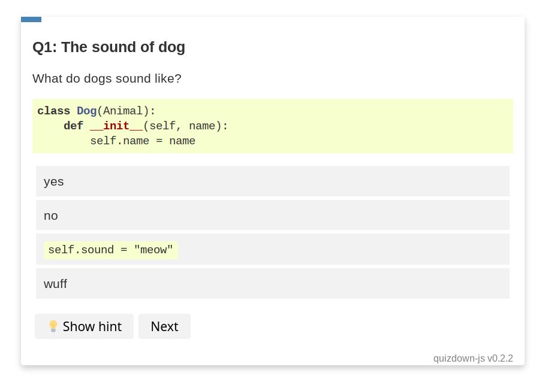

# hugo-quizdown


A hugo shortcode for writing quizzes with a markdown-like syntax: [quizdown-js](https://github.com/bonartm/quizdown-js). See the [demo](https://bonartm.github.io/hugo-quiz/) based on the hugo learn theme or checkout the [live code editor](https://bonartm.github.io/quizdown-live-editor/).

> The quizzes are for fun and not for serious assessment. Since everything is rendered on the client side, the hints and solutions to the questions become visible once javascript is disabled in the browser.

## Installation

1. Copy the content from `demo/layouts/shortcodes/quizdown.html`  into your local hugo project `layouts/shortcodes/` folder.
2. Add the `quizdown.js` to your project. For the hugo-learn theme you can create a file `layouts/partials/custom-header.html` with the following content:
```html
<script 
src="https://cdn.jsdelivr.net/gh/bonartm/quizdown-js@0.2.2/public/build/quizdown.js">
</script>
<script>quizdown.init()</script> 
```
**Currently, the `--minify` flag of the hugo command causes issues with the raw quizdown-markdown code. Please remove the flag when building your website or use the following option in your `config.toml`**:

```toml
[minify]
  disableHTML = true
```


## Usage

Write quizzes in plain markdown in any of your files in the `content` directory:

```markdown

# Hugo Quiz



---
primary_color: orange
secondary_color: lightgray
text_color: black
shuffle_questions: false
---

## The sound of dog

---
shuffle_answers: false
---

What do dogs sound like?

> Some hint

- [ ] yes
- [ ] no
- [ ] `self.sound = "meow"`
- [x] wuff

## Put the [days](https://en.wikipedia.org/wiki/Day) in order!

> Monday is the *first* day of the week.

1. Monday
2. Tuesday
3. Wednesday
4. Friday
5. Saturday  

```



## Demo

Tested with version `0.80.0` of Hugo and the Hugo Learn theme.

Visit https://bonartm.github.io/hugo-quiz/ for a live demo based on the [hugo-learn](https://themes.gohugo.io/theme/hugo-theme-learn/en) theme. You can also view a local version of the demo. 

First download the theme:

```shell
git submodule update --init --recursive
```

Then start the server:

```shell
cd demo
hugo server -D
```
