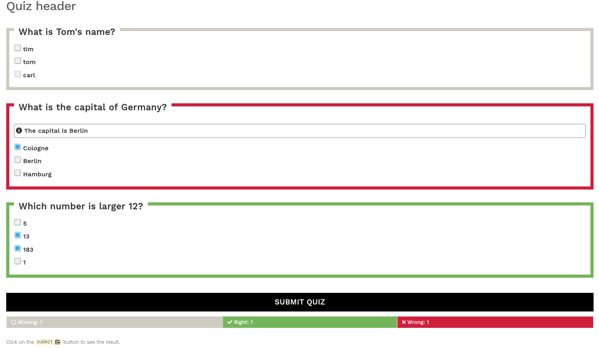

# hugo-quiz

A custom [hugo shortcode](https://gohugo.io/content-management/shortcodes/#readout) for interactive quizzes. See the demo [here](https://bonartm.github.io/hugo-quiz/).

## Installation

Copy the content from `src` into your local hugo project folder. This project defines 2 shortcodes: `quiz.html` and `item.html`.


## Usage

Create quizzes as hugo shortcodes in any of your markdown files in the `content` directory

```markdown

Here is a simple example of a quiz, written in markdown using hugo shortcodes

{}

## Quiz header



{}

Click on the `submit` button to see the result.
```



## Demo

Visit https://bonartm.github.io/hugo-quiz/ for a live demo based on the [hugo-learn](https://themes.gohugo.io/theme/hugo-theme-learn/en) theme.

You can also build a local of version of the demo by typing:

```shell
cd demo
hugo server -D
```

## Credits

Initial quiz logic and styling adopted from https://github.com/zimmicz/javascript-quiz-library
